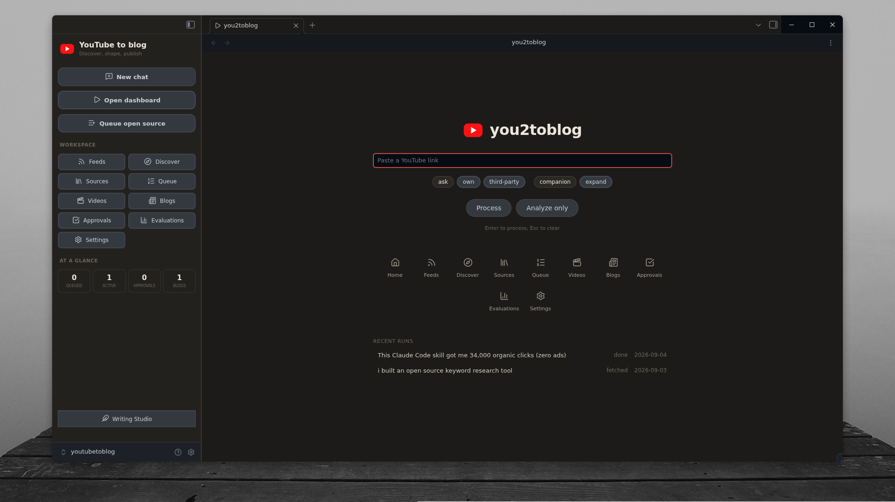
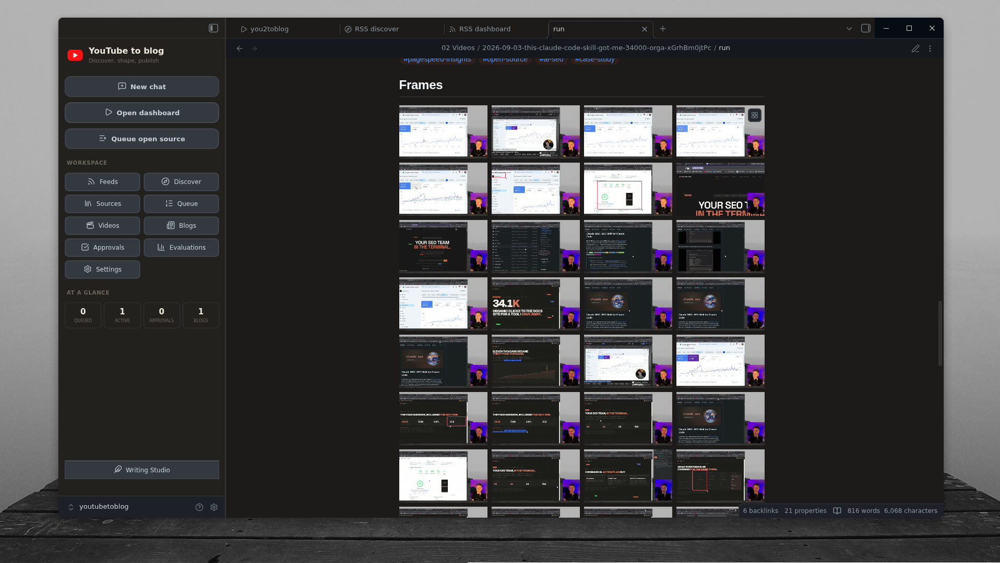
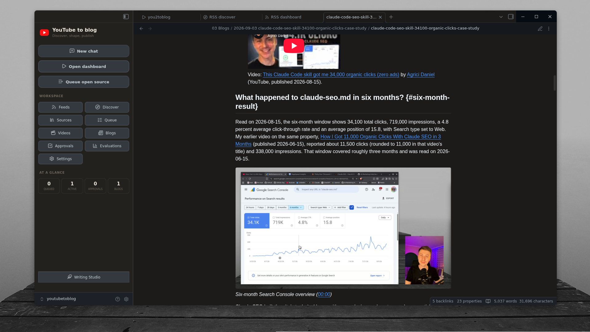
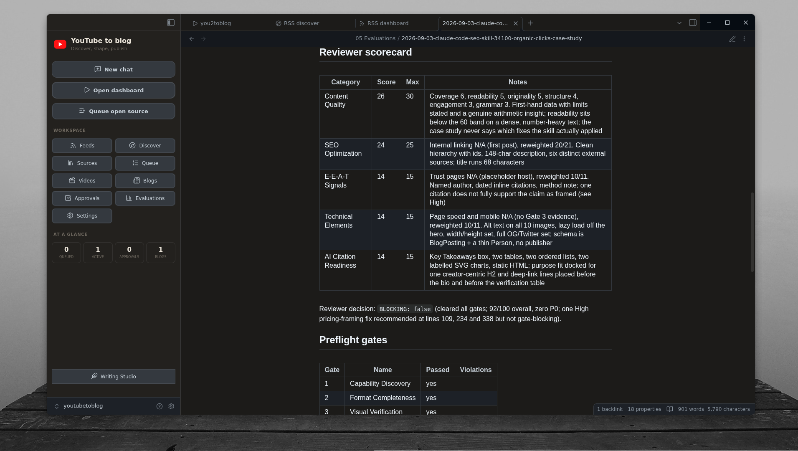

# you2toblog

Turn a YouTube video into a reviewable blog article inside Obsidian.

Collect the source, inspect its transcript and frames, approve an article direction, and finish the draft in Writing Studio. The video, article, approvals, and evaluation stay connected in your vault.

**Preview status:** public-release acceptance is still in progress. See [acceptance and release evidence](docs/ACCEPTANCE.md) before relying on this workflow. The setup guide pins the public claude-blog release. The required video analyzer restricts commercial use. Read the [setup prerequisites](docs/SETUP.md) before installing.

## From video to article

1. **Add a video.** Paste its YouTube link and record whether it is yours or third-party material.
2. **Analyze the source.** Collect metadata, captions, timestamped frames, and a content brief.
3. **Approve the direction.** Review up to three article ideas and select the ones to develop. Outline approval is enabled by default.
4. **Review the draft.** Inspect the article, attribution, links, images, and recorded quality checks.
5. **Finish in Writing Studio.** Make your final edits, then export or publish yourself.

**Process** takes a new video through analysis and strategy, then pauses for approval. **Analyze only** stops after the content brief. Both actions can use paid provider services. Neither publishes an article.

**Companion** creates an article that works beside the video. **Expand** uses the video as one source in a broader article.

## Inspect the source

Run notes keep the analysis and extracted frames together, so you can trace the draft back to the video.

## Review the article

Drafts can include timestamped video links, creator attribution, selected frames, and charts supported by source data.

This is a historical example, not an accepted release fixture. The screenshot includes a visible heading-anchor marker; native Markdown rendering remains an acceptance item.

## See the quality checks

Each delivered article receives an evaluation covering the review score, delivery gates, source overlap, frame placement, attribution, links, and voice checks.

The example evaluation predates the current six-gate contract. Its displayed score and clearance are historical results, not proof that the article passes the current checks. A fresh accepted example is still required.

## Your workspace

The vault includes Home, Feeds, Discover, Sources, Queue, Videos, Blogs, Approvals, Evaluations, Settings, and help in the Home note. A local Obsidian plugin provides the landing page and sidebar. The pipeline skill, two specialist agents, templates, and operating guides live alongside the content.

- Rights are recorded for each video. Third-party material has tighter quotation, frame, and attribution rules.
- Strategy approval is required; outline approval is enabled by default. Only an explicitly requested `--auto` run changes those approval pauses.
- API keys stay outside the vault and Git.
- Personal runs, drafts, decisions, evaluations, voice files, and chat exports are ignored by default. Check the public file selection before sharing a copy.
- RSS discovery and AI image generation are optional. Paid images need their own approval.
- Publishing remains a human action.

## Setup

Follow [the setup guide](docs/SETUP.md). You need Obsidian Desktop, Claude Code, Node.js with npm, Python 3.11 or newer, `yt-dlp`, `ffmpeg`, and `ffprobe`, plus the external analysis and blog tools.

The guide covers the pinned Obsidian plugin installer, the Claude adapter, provider keys, personal settings, and the setup doctor. Video analysis uses Gemini. Captionless videos need an optional transcription provider. The workflow does not require a YouTube Data API key.

The current setup is desktop-focused. Fresh-machine installation, native Obsidian behavior, and live end-to-end acceptance remain release requirements. Optional features without completed acceptance must be treated as experimental.

## Development and security

See the [release notes](CHANGELOG.md) for changes, upgrade guidance, verification, and known limitations.

Read [CONTRIBUTING.md](CONTRIBUTING.md) for checks and [SECURITY.md](SECURITY.md) for reporting issues. The full operating manual is [inside the vault](06%20AI%20Team/03%20Knowledge/System%20Manual.md).

Exact dependency versions and source links are recorded in `_system/plugin-lock.json` and [THIRD_PARTY_NOTICES.md](THIRD_PARTY_NOTICES.md).

## License

This repository's original code is MIT licensed; see [LICENSE](LICENSE). Dependencies retain their own licenses.

The required [video-analyzer license](https://github.com/docusphere/video-analyzer/blob/151e8782c564093c3aa7339e2adc744aab25001b/LICENSE) permits personal, educational, and non-commercial use. Commercial use requires prior written permission from its copyright holder. This repository's MIT license does not remove that restriction from the analyzer.

YouTube is a trademark of Google LLC. This project is not affiliated with or endorsed by YouTube.
