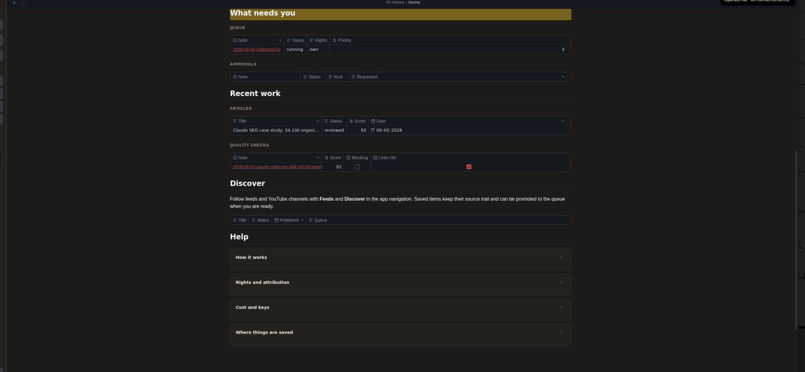
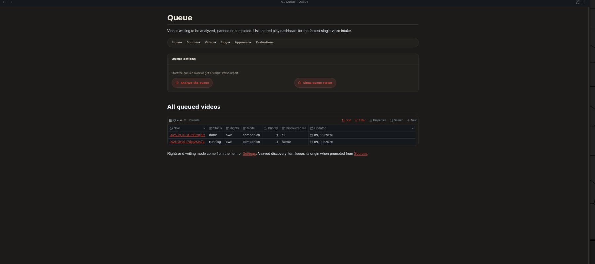

# youtubetoblog

Turn a YouTube video into a reviewable blog article, without leaving Obsidian.

This is a private preview. It combines a calm dashboard, a guided AI team, human approvals, and a tidy vault where every source, draft, decision, and quality check stays connected.

## What it does

Paste a YouTube link and choose whether the video is yours or belongs to someone else. youtubetoblog can then:

- collect the title, captions, chapters, and useful moments;
- propose up to three article ideas;
- pause for your approval before writing;
- create a draft with timestamped video links and selected frames;
- check the finished article and record the score;
- keep publishing as a deliberate human action.

The app supports two writing styles. **Companion** creates an article that works beside the video. **Expand** uses the video as one source in a broader article.

## A simple workflow

1. **Add** a video from Home or the Queue.
2. **Review** the proposed article direction.
3. **Create** the approved draft with the AI team.
4. **Finish** the article in Writing Studio, then publish it yourself.

The dedicated Queue page keeps detailed operational data available without crowding Home.

## Designed for control

- Every strategy and outline can require an approval note.
- Rights are recorded as `own` or `third-party` for each video.
- Third-party material receives stricter quotation, frame, and attribution rules.
- API keys stay outside the vault and outside Git.
- Personal runs, drafts, approvals, evaluations, voice files, and chat exports are ignored by default.
- Nothing is published automatically.

## What is included

- An Obsidian application shell with Home, Feeds, Discover, Sources, Queue, Videos, Blogs, Approvals, Evaluations, Settings, and Help pages.
- A vault-local Home plugin that controls the landing page and sidebar.
- A `youtube-to-blog` skill that runs the pipeline in a fixed, reviewable order.
- Two focused agents for video analysis and article strategy.
- Templates, operating guides, quality gates, tests, and a pinned plugin record.
- Optional RSS discovery and optional AI image generation.

## Private preview setup

1. Clone the private repository.
2. Open the folder as a vault in Obsidian Desktop.
3. Follow the friendly setup guide in [`docs/SETUP.md`](docs/SETUP.md).
4. Run the setup check before processing a video.
5. Reload Obsidian after installing the local Home plugin.

You need Obsidian Desktop, Claude Code, Python 3.11 or newer, `yt-dlp`, `ffmpeg`, and `ffprobe`. Video analysis uses a Gemini key. The current workflow does **not** need a YouTube Data API key.

## Current limits

- Desktop is the supported Obsidian experience.
- RSS discovery uses a pinned, safety-patched build supplied as source and patch instructions. The core writing workflow works without RSS.
- Videos without captions need an optional Whisper provider key, or they cannot be transcribed automatically.
- Optional AI images can cost money and always require a separate approval.
- This preview does not yet include a one-click installer.

## Safety and contribution

Please read [`SECURITY.md`](SECURITY.md) before reporting a security issue. Changes are welcome through a branch and pull request after following [`CONTRIBUTING.md`](CONTRIBUTING.md).

The complete operating manual lives inside the vault at `06 AI Team/03 Knowledge/01 Guidelines/System Manual.md`. Exact versions and source links are recorded in `_system/plugin-lock.json` and [`THIRD_PARTY_NOTICES.md`](THIRD_PARTY_NOTICES.md).

## License

MIT, see [`LICENSE`](LICENSE).

YouTube is a trademark of Google LLC. This project is not affiliated with or endorsed by YouTube.
